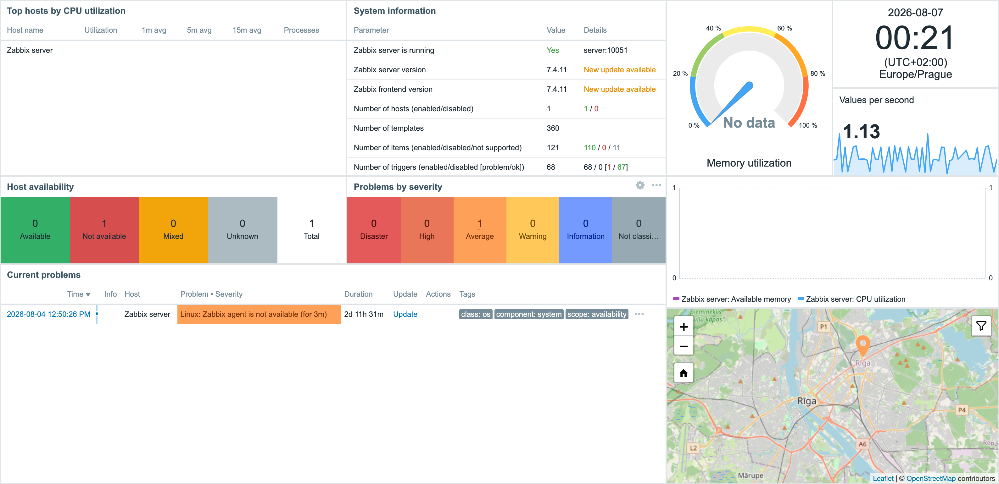
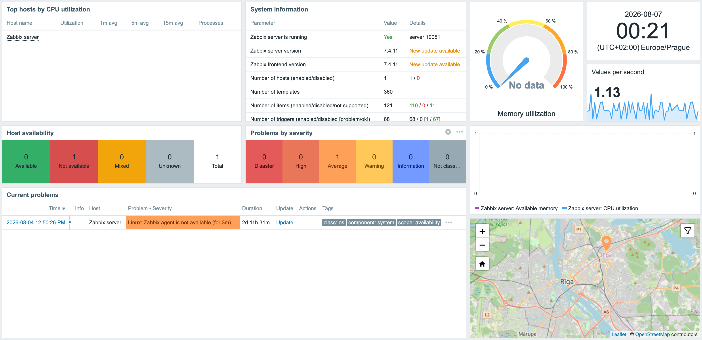
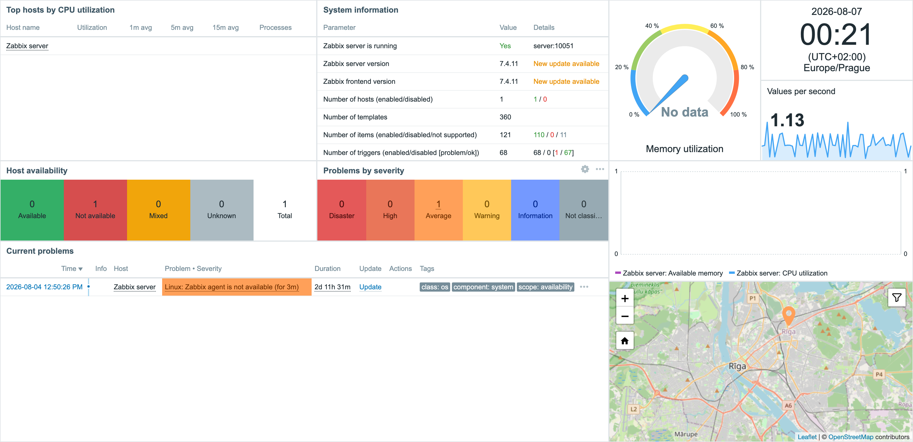

<h1>Compact dashboard</h1>

developed and maintained by

and community

<strong>Gives you back the space Zabbix puts around every dashboard widget.</strong> 
On a wall display or a packed operations board that padding is the difference between one screen and two - this module removes it, and changes nothing else.

<a href="#what-it-does"><strong>What it does</strong></a> &nbsp;·&nbsp;
<a href="#before-and-after"><strong>Before and after</strong></a> &nbsp;·&nbsp;
<a href="#install"><strong>Install</strong></a> &nbsp;·&nbsp;
<a href="#requirements"><strong>Requirements</strong></a> &nbsp;·&nbsp;
<a href="https://portal.initmax.com"><strong>Portal</strong></a> &nbsp;·&nbsp;
<a href="https://www.initmax.com/wiki/compact-dashboards/"><strong>Docs</strong></a>

 

---

## What it does

Zabbix reserves a few pixels around every widget on a dashboard. It looks fine on a laptop and it is wasted space on a 55" screen in the NOC, where the same board could show a couple more rows instead.

**Compact dashboard** removes that padding and pulls each widget's header flush with its frame. There is nothing to configure and nothing to learn: install it, enable it, and every dashboard gets tighter. Turn the module off and Zabbix looks exactly as it did before - the module only ships a stylesheet, so there is nothing else it could change.

## Before and after

<table>
<tr>
<td width="50%" align="center" valign="top"> <small><b>Standard Zabbix</b> - a gap around every widget</small></td>
<td width="50%" align="center" valign="top"> <small><b>With Compact dashboard</b> - the same board, more of it visible</small></td>
</tr>
</table>

## Install

The module ships as a **GPG-signed `deb` / `rpm` package** from the initMAX repository - `apt` / `dnf` installs it and keeps it updated.

### Easiest way - the guided installer on the Portal

Open the product page, pick your **OS**, and copy the ready-made command. It is fully public, no login needed. There's a feedback box right there too.

<a href="https://portal.initmax.com/catalog/zabbix-compact-dashboard#how-to-install"><strong>→ Open the installer on the Portal</strong></a>

Prefer a plain archive? Every release also ships as a **ZIP** [straight from the repo](https://repo.initmax.com/zabbix/free/zip/compact-dashboard/) - handy for offline or manual installs.

Then enable it in **Administration → General → Modules**. Done - open any dashboard.

## Requirements

|              |                                                              |
| ------------ | ------------------------------------------------------------ |
| **Zabbix**   | 6.0 · 6.2 · 6.4 · 7.0 · 7.2 · 7.4 - one package covers all    |
| **PHP**      | 7.4 or newer                                                 |
| **OS**       | Debian/Ubuntu · RHEL/Rocky/Alma/Oracle/Amazon · SUSE         |
| **Edition**  | FREE - there is no paid edition of this module               |
| **Languages** | Every language Zabbix supports. The module renders no text of its own - it is a stylesheet - so nothing in your interface changes language |
| **High availability** | Ready. A stylesheet only - no server-side component and no local state; install it on every frontend node of an HA cluster and any node can serve it |

One package covers the whole range. Zabbix renamed the widget header element in 7.0 and changed its module API at 6.4, and the package carries what each frontend needs, so the same install works on 6.0 and on 7.4.

## Support &amp; links

- 📚 **[Documentation / Wiki](https://www.initmax.com/wiki/compact-dashboards/)**
- 🛒 **[Product page](https://www.initmax.com/product/compact-dashboard/)**
- 🎫 **[Portal](https://portal.initmax.com)** - downloads, support tickets
- 💾 **Source code** (AGPLv3) - included in every package and published as a [source archive](https://repo.initmax.com/zabbix/free/zip/compact-dashboard/) on repo.initmax.com
- ✉️ **[support@initmax.com](mailto:support@initmax.com)**

---

<a href="https://www.gnu.org/licenses/agpl-3.0.html">AGPLv3</a> &nbsp;·&nbsp; © 2021–2026 initMAX s.r.o.

