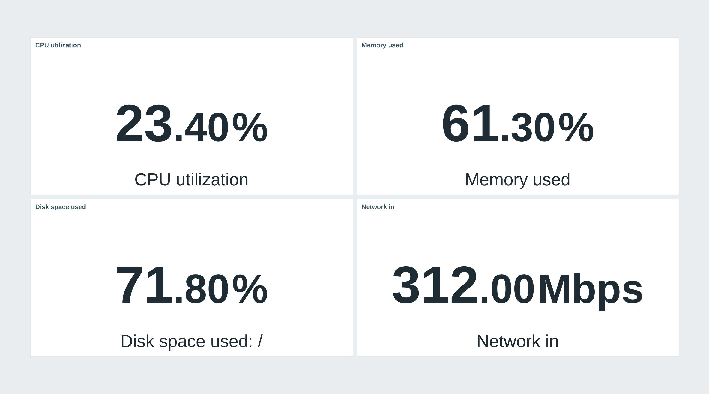
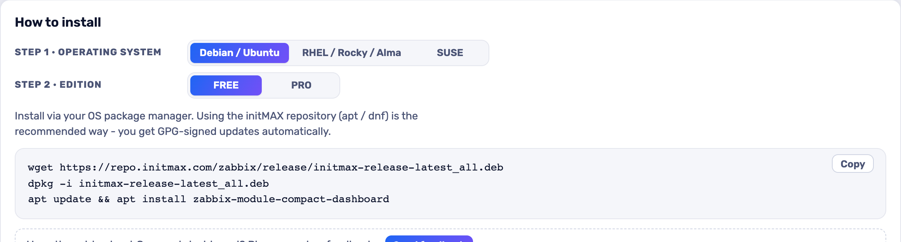

<h1>Compact dashboard</h1>

developed and maintained by

and community

<strong>Gives you back the space Zabbix puts around every dashboard widget.</strong> 
On a wall display or a packed operations board that padding is the difference between one screen and two - this module removes it, and changes nothing else.

<a href="#what-you-can-build"><strong>Features</strong></a> &nbsp;·&nbsp;
<a href="#examples"><strong>Examples</strong></a> &nbsp;·&nbsp;
<a href="#install"><strong>Install</strong></a> &nbsp;·&nbsp;
<a href="#free-vs-pro"><strong>FREE vs PRO</strong></a> &nbsp;·&nbsp;
<a href="https://portal.initmax.com"><strong>Portal</strong></a> &nbsp;·&nbsp;
<a href="https://www.initmax.com/wiki/compact-dashboards/"><strong>Docs</strong></a>

 

---

## Why Compact dashboard

Zabbix reserves a few pixels around every widget on a dashboard. It looks fine on a laptop and it is wasted space on a 55" screen in the NOC, where the same board could show a couple more rows instead.

**Compact dashboard** removes that padding and pulls each widget's header flush with its frame. There is nothing to configure and nothing to learn: install it, enable it, and every dashboard gets tighter. Turn the module off and Zabbix looks exactly as it did before - the module only ships a stylesheet, so there is nothing else it could change.

## What you can build

<table>
<tr>
<td width="50%" valign="top">

**Denser dashboards**

The padding around every widget is removed, so the same screen fits more of what you actually monitor.

</td>
<td width="50%" valign="top">

**Headers flush with the tile**

Widget headers sit on the tile frame instead of floating inside it - cleaner on wall displays.

</td>
</tr>
<tr>
<td width="50%" valign="top">

**Nothing to configure**

Install, enable, done. Every dashboard and every user gets the compact layout at once.

</td>
<td width="50%" valign="top">

**Stylesheet only**

No PHP, no API - disable the module and Zabbix looks exactly as before.

</td>
</tr>
</table>

## Examples

<table>
<tr>
<td width="50%" align="center" valign="top"> <small><b>Without module</b> - Standard Zabbix: a gap around every widget.</small></td>
</tr>
</table>

## Configuration

There is nothing to configure - install it, enable it, done.

## Install

**FREE** ships as **GPG-signed `deb` / `rpm` packages** from the initMAX repository - `apt` / `dnf` installs them and keeps them updated.

### Easiest way - the guided installer on the Portal

Open the product page, pick your **OS** and **edition**, and copy the ready-made command. FREE is fully public (no login); PRO fills in your token once you sign in. There's a feedback box right there too.

<a href="https://portal.initmax.com/catalog/zabbix-compact-dashboard#how-to-install"><strong>→ Open the installer on the Portal</strong></a>

Prefer a plain archive? Every release also ships as a **ZIP** [straight from the repo](https://repo.initmax.com/zabbix/free/zip/compact-dashboard/) - handy for offline or manual installs.

The module is enabled automatically during the package installation - verify it in **Administration → General → Modules**. Done.

## FREE vs PRO

There is no paid edition - everything below is in the one package.

| Feature | FREE |
| ---------------------------------------------------------- | :----: |
| Removes the padding around every dashboard widget | ✅ |
| Widget headers flush with the tile frame | ✅ |
| Nothing to configure - install and enable | ✅ |
| Stylesheet only - disable it and Zabbix looks as before | ✅ |
| Localised into all 25 Zabbix display languages | ✅ |
| High availability ready | ✅ |
| Licence | AGPLv3 |

## Requirements

|              |                                                              |
| ------------ | ------------------------------------------------------------ |
| **Zabbix**   | 6.0 · 6.2 · 6.4 · 7.0 · 7.2 · 7.4 - one package covers all    |
| **PHP**      | 7.4 or newer                                                 |
| **OS**       | Debian/Ubuntu · RHEL/Rocky/Alma/Oracle/Amazon · SUSE         |
| **Editions** | FREE (public repo) - there is no paid edition                  |
| **Languages** | All 25 Zabbix display languages - the module follows each user's own language setting |
| **High availability** | Ready. A stylesheet only - no server-side component and no local state; install it on every frontend node of an HA cluster and any node can serve it |

One package covers the whole range. Zabbix renamed the widget header element in 7.0 and changed its module API at 6.4, and the package carries what each frontend needs, so the same install works on 6.0 and on 7.4.

## Support &amp; links

- **[Documentation / Wiki](https://www.initmax.com/wiki/compact-dashboards/)**
- **[Product page](https://www.initmax.com/product/compact-dashboard/)**
- **[Portal](https://portal.initmax.com)** - downloads, tokens, support tickets
- **Source code (FREE, AGPLv3)** - included in every package and published as a [source archive](https://repo.initmax.com/zabbix/free/zip/compact-dashboard/) on repo.initmax.com
- **[support@initmax.com](mailto:support@initmax.com)**

---

FREE: <a href="https://www.gnu.org/licenses/agpl-3.0.html">AGPLv3</a> &nbsp;·&nbsp; © 2021–2026 initMAX s.r.o.

